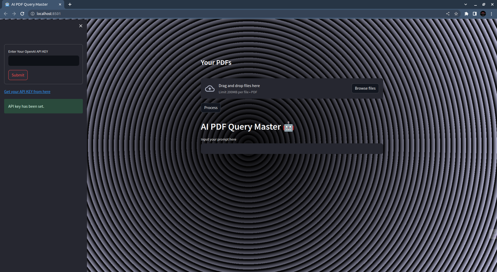
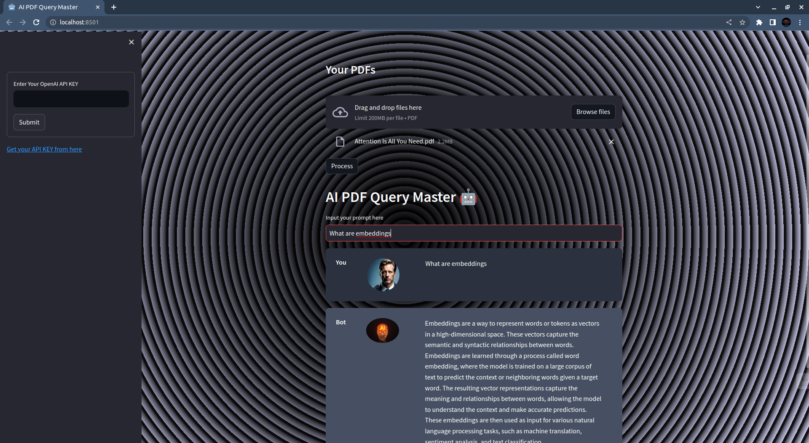

# AI-PDF-Query-Master

The "AI PDF Query Master" is a web application that leverages the OpenAI API to enable users to upload PDF documents and interactively query them using natural language. It harnesses the capabilities of the OpenAI ChatGPT language model to provide intelligent and contextual responses to user queries.

## Features:
- Upload PDF documents: Users can easily upload their PDF files directly within the app.
- Interactive chat interface: The app offers a user-friendly chat interface where users can ask questions, seek information, and provide instructions to retrieve relevant details from the uploaded PDF documents.
- Natural language processing: Powered by the OpenAI ChatGPT model, the app intelligently understands and responds to user queries in a conversational manner.
- Query history and context: The app maintains a history of previous queries and maintains context during the conversation, allowing users to refer back to previous questions and continue the flow seamlessly.
- Fast and accurate results: The app employs advanced natural language processing techniques to quickly analyze and extract pertinent information from the uploaded PDFs, providing users with precise answers and insights.




## Usage:
1.Provide your OpenAI API key
2. Upload your PDFs: Simply drag and drop your PDF files or use the browse files feature to import them into the app.
3. Start the conversation: Enter your query or question in the chat interface and let the app provide you with relevant answers.

By combining the power of OpenAI's ChatGPT with PDF processing capabilities, the "AI PDF Query Master" simplifies the extraction of insights and knowledge from large PDF collections, making it a valuable tool for researchers, students, and professionals working with extensive document repositories.

## Installation
----------------------------
To install the AI-PDF-Query-Master App, please follow these steps:

1. Clone the repository to your local machine.

2. Install the required dependencies by running the following command:
   ```
   pip install -r requirements.txt

   ```
3.Make sure you have installed the necessary dependencies.
4.Execute the following command to run the application using terminal:
   ```
    streamlit run app.py

   ```
5.The application will open in your default web browser, presenting the user interface.
6.Follow the instructions provided within the application to load multiple PDF documents.
7.Utilize the chat interface to ask questions about the loaded PDFs using natural language.
Get started with AI-assisted PDF querying today and unlock the potential of your PDF documents!

